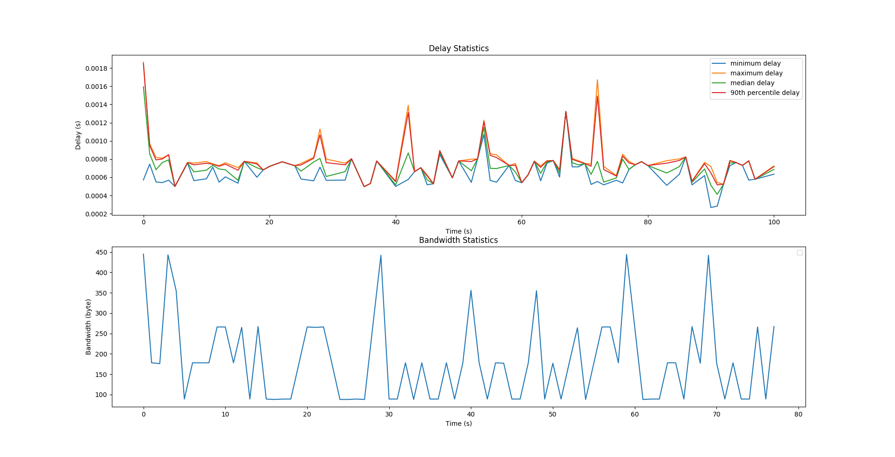
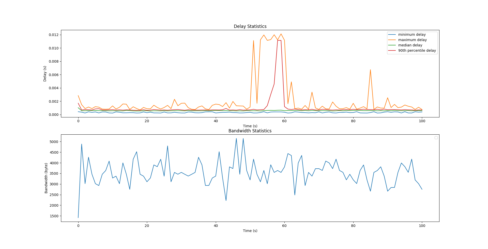

<!-- Convert using [`pandoc`](https://pandoc.org/) -->
# MP0 Report

## Group Members

The only member in this group is me (Name: Haoqing Zhu, NetID: haoqing3).

## Cluster Information

The cluster number I'm using is 21, i.e. the addresses of the VMs are in the form `sp20-cs425-g21-{01..10}.cs.illinois.edu`.

## Source Code

The source code of this MP is located here: <https://gitlab.engr.illinois.edu/haoqing3/ece428-mp0>, in the mp0 directory. The full SHA hash is `7be6ad8f1bbdb60e1db12a466dcd84b667a5b510`.

## Building & Running Instructions

You need to install [Rust](https://rust-lang.org) to be able to build this MP. After cloning the repo, simply run `make`. The built binaries would be located in `target/release/logger` and `target/release/node`.

Run the binaries as specified in the MP doc. `logger` accepts one numeric argument as the port number, and outputs the timestamps on connection, receiving the message and connection termination. It will also output the delay and message size on `stderr` for graph generation and analysis. `node` accepts 3 positional arguments, which are the name of the node, the address of the central server, and the port the server is listening on. It then will read from `stdin` lines of timestamps and messages separated by a single whitespace, and attempt to send the messages to the central server.

## Graphs

The following graphs are generated according to the senarios in the MP doc. The first is run with 3 nodes each running at 0.5 Hz. The second is run with 8 nodes each running at 5 Hz. For each of the senarios, 2 graphs are generated, with the first one being the min, max, median and 90^th^ percentile of the delays for each second, and the second one being the bandwidth used for each second.

The delay for each connection is measured by taking the time difference between when the event was sent (i.e. the timestamp in the payload), and the time immediately after the payload is parsed (i.e. after the payload has been read by the server). In the graph the statistics of the delays are derived from all the messages received during a natural full second. The bandwidth is calculated as the average bandwidth for each second, i.e. the total sizes of the messages received inside a natural full second divided by 1 second.

