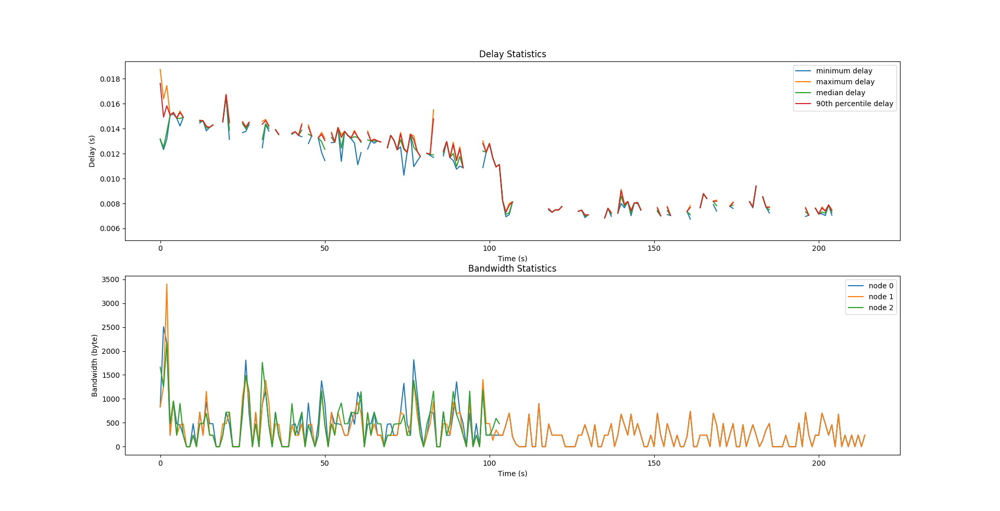
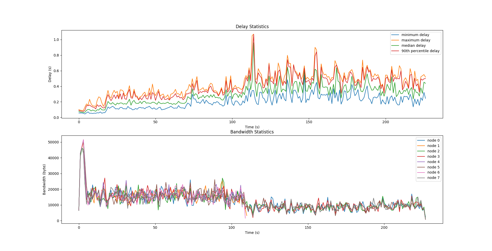

<!-- Convert using [`pandoc`](https://pandoc.org/) -->
# MP1 Report

## Group Members

The only member in this group is me (Name: Haoqing Zhu, NetID: haoqing3).

## Cluster Information

The cluster number I'm using is 21, i.e. the addresses of the VMs are in the form `sp20-cs425-g21-{01..10}.cs.illinois.edu`.

## Source Code

The source code of this MP is located here: <https://gitlab.engr.illinois.edu/haoqing3/ece428-mp1>. The full SHA hash is `8fe207168bf0a30dacc408e398abe9e48de108f7`.

## Building & Running Instructions

You need to install [Rust](https://rust-lang.org) to be able to build this MP. After cloning the repo, simply run `make`. The built binaries would be located in `target/release/node`.

<!--TODO Protocol designs-->

## Graphs

The following graphs are generated according to the senarios in the MP doc. To simplify testing and graph generation however, senario 1 and 2 are ignored, as they're already part of senarios 3 and 4 respectively. The graphs generated below shows the 2 senarios run. The first is run with 3 nodes each running at 0.5 Hz. The second is run with 8 nodes each running at 5 Hz. For each of the senarios, 2 graphs are generated, with the first one being the min, max, median and 90^th^ percentile of the delays for each second, and the second one being the bandwidth used for each second.

The delay is calculated by averaging the time it takes from right before the multicaster is sending out the message to right after each node delivers the message and right before the message is processed. In the graph the statistics of the delays are derived from all the multicasts performed during a natural full second. As the gRPC library I'm using doesn't provide any statistics, the bandwidth is obtained by using `tcpdump` to sniff the gRPC packets between the nodes.

